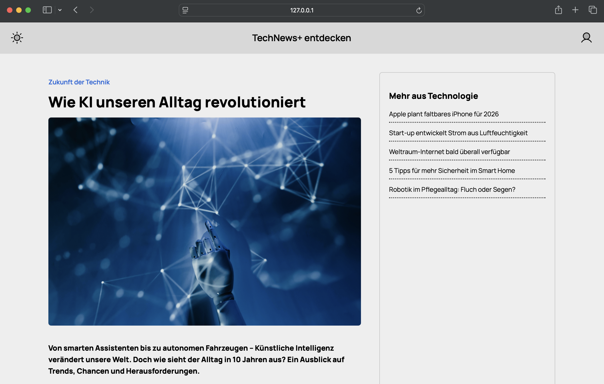
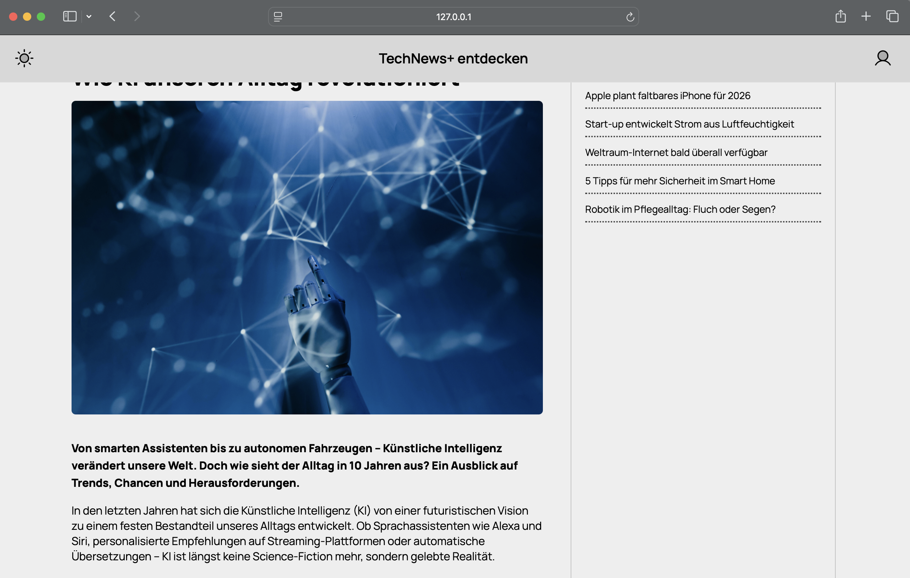

# CSS Arena – Aufgabe 3: News Page (Topbar, Sidebar und Content)

## Thema: Die Zukunft der Technik und Künstliche Intelligenz 🤖 🌍

Erstelle eine CSS-Datei `styles.css`, die das Layout und Design der folgenden Webseite umsetzt, die sich mit den neuesten Entwicklungen der Künstlichen Intelligenz beschäftigt.

> 🧱 Die HTML-Struktur ist bereits vorgegeben in `index.html` und **darf nicht verändert werden**.

### Designvorgabe:

### Anforderungen:

- Ein **sticky** Header mit zwei Icons (rechts und links)
- Ein **Artikelbereich** auf der linken Seite mit einer großen Überschrift und einem Bild
  - Der Artikel soll eine prägnante Einführung und mehrere Absätze zum Thema Künstliche Intelligenz enthalten
- Eine **Sidebar** rechts, die eine Liste von verwandten Artikeln zeigt
- Alle Elemente sollten **abgerundete Ecken** und ein einheitliches Design mit einer klaren Struktur aufweisen
- Schriftart: Manrope
- Hintergrundfarbe der Seite: hellgrau (`#eee`)
- Verwendung von **Flexbox**, um die Layoutstruktur zu erstellen
- Achte auf **Abstände, Schriftgrößen und Hover-Effekte**:
  - Die Sidebar-Links sollen beim Überfahren unterstrichen werden
  - Icons in der oberen Leiste sollen beim Hover eine Hintergrundfarbe ändern
- Die Seite soll in einem modernen und ansprechenden Stil gehalten sein

---

💡 **Tipp:** Achte auf **Responsive Design**, damit die Seite auch auf kleineren Geräten gut aussieht. Verwende `max-width`, `padding` und `margin`, um die Inhalte gut zu verteilen.

Viel Spaß beim Coden! 🚀
